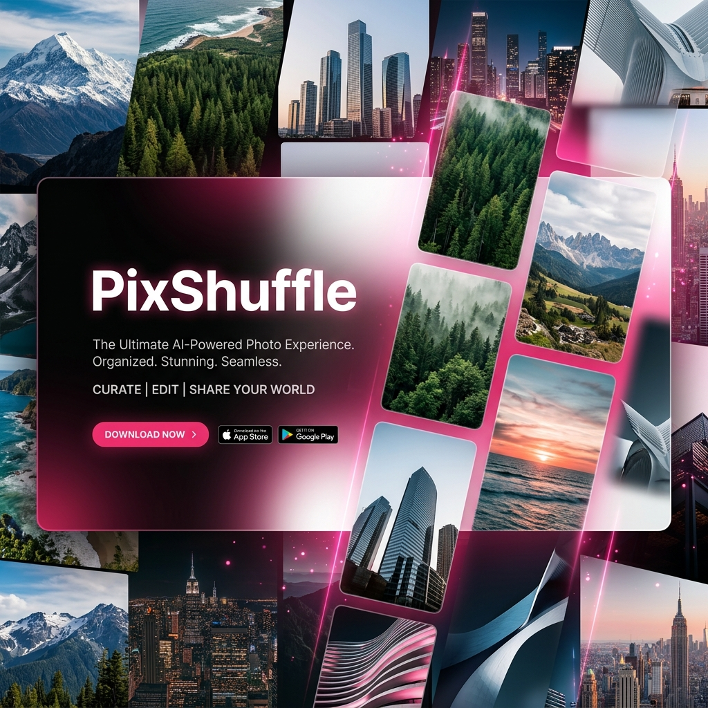

# 📸 PixShuffle

<div align="center">
  
  
  <p align="center">
    <strong>A premium, high-performance image gallery experience for discovery and inspiration.</strong>
  </p>

  [](https://expo.dev)
  [](https://reactnative.dev)
  [](https://www.typescriptlang.org/)
  [](https://opensource.org/licenses/MIT)
</div>

---

## ✨ Overview

**PixShuffle** is a state-of-the-art image discovery application built with the Expo ecosystem. It combines a sleek, modern UI with cutting-edge performance features to provide a seamless catalog of high-quality photography. Whether you're looking for inspiration or just browsing, PixShuffle offers a fluid, gesture-driven experience that feels at home on any device.

Developed with precision and care by **[Biswo (biswo907)](https://github.com/biswo907)**.

---

## 🚀 Premium Features

### 🖼️ Elite Visuals & Performance
- **Infinite Discovery Feed**: Explore thousands of high-resolution images from the Picsum API with optimized lazy loading.
- **Next-Gen Image Caching**: Powered by `expo-image` for lightning-fast loading, smooth opacity transitions, and reduced memory overhead.
- **Smart Skeleton Loaders**: Content-aware shimmer animations that provide a polished, "high label" feel during data fetching.

### 🎨 Stunning UI/UX
- **Interactive Modals**: A rich detail view for every image, presenting resolution, author metadata, and quick action bars.
- **Dynamic Themes**: Native Dark and Light mode support with persistent user preference storage.
- **Fluid Motion**: Built with `react-native-reanimated` for smooth layout transitions and entering animations.
- **Haptic Feedback**: Meaningful tactile responses integrated into every major interaction.

### 🛠️ Native Integration
- **Direct Save**: Download any image directly to your device's local gallery via `expo-media-library`.
- **Instant Sharing**: Share inspiration on the fly using the native iOS/Android sharing sheets.
- **Personal Collection**: A dedicated "Favorites" suite to curate and manage your most-loved photos.
- **OTA Updates**: Stay up-to-date with the latest features and fixes seamlessly via Expo EAS Updates.

---

## 🛠️ Tech Stack

| Technology | Purpose |
| :--- | :--- |
| **Expo SDK 54** | Core platform and native module integration |
| **React Native 0.81** | Cross-platform framework for iOS and Android |
| **Expo Router** | Revolutionary file-based routing and navigation |
| **Reanimated** | High-performance gesture and animation engine |
| **Expo Image** | High-performance image rendering and caching |
| **AsyncStorage** | Local persistence for themes and favorites |
| **Expo Updates** | Over-The-Air (OTA) update delivery and management |
| **Native APIs** | Media Library, Sharing, Haptics, and File System |

---

## 🚀 Getting Started

### Prerequisites
- Install **Node.js** (LTS)
- Install the **Expo Go** app on your physical device for the best experience.

### Installation
1.  **Clone the Repository**
    ```bash
    git clone https://github.com/biswo907/PixShuffle.git
    cd PixShuffle
    ```
2.  **Install Dependencies**
    ```bash
    npm install
    ```
3.  **Launch the App**
    ```bash
    npx expo start
    ```

### Running on Devices
- **iOS/Android**: Scan the QR code in your terminal using the Expo Go app.
- **Web**: Press `w` in the terminal to view the web-optimized version.

---

## 🔄 App Updates (EAS)

PixShuffle is configured with **Expo EAS Updates**, allowing for seamless, over-the-air improvements without requiring manual store updates. 

- **Automated Checks**: The app automatically checks for updates on launch.
- **Seamless Delivery**: High-priority fixes and new features are delivered through dedicated Expo channels.
- **User-Friendly UI**: A custom update modal keeps you informed when a fresh experience is being applied.

---

## 📂 Project Structure

```text
├── app/               # Main application screens (Expo Router)
│   ├── index.tsx      # Main Gallery feed
│   └── favorites.tsx  # Personal collection view
├── components/        # Reusable UI architecture
│   ├── ImageDetailModal.tsx
│   ├── ShimmerSkeleton.tsx
│   ├── UpdateModal.tsx    # Premium update notification UI
│   └── PageWrapper.tsx
├── constants/         # Theming and design tokens
├── hooks/             # Custom React hooks
│   └── UpdateHandler.tsx  # OTA update logic & lifecycle
├── utils/             # Cross-platform utilities (toasts, handlers)
└── assets/            # High-fidelity static assets & logos
```

---

## 📄 License

Distributed under the **MIT License**. See [`LICENSE`](./LICENSE) for more information.

---

<div align="center">
  <p>Built with ❤️ by <strong>Biswo</strong></p>
  <a href="https://github.com/biswo907">
    
  </a>
</div>
